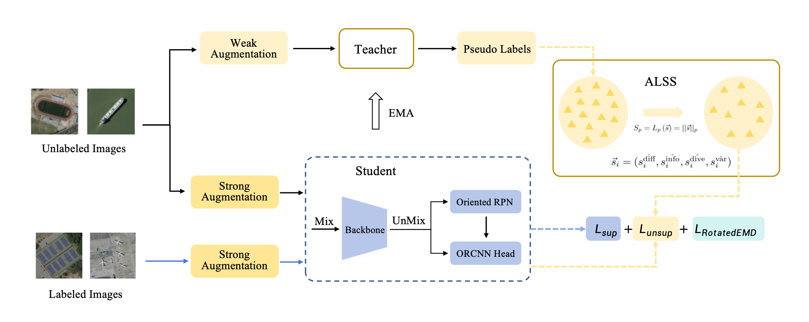

# ALS_Teacher

An official implementation of the paper "ALS Teacher: Active Label Selection for Semi-Supervised Oriented  Object Detection in Remote Sensing Imagery".

## Introduction

Semi-supervised object detection (SSOD) in remote sensing scenarios is fundamentally challenged by orientation-sensitive pseudo-label noise under limited supervision, where arbitrary object rotations and complex spatial distributions significantly degrade label reliability. Although SSOD has shown promising results in natural images, existing methods predominantly focus on horizontal object detection and struggle to generalize to oriented settings. Building upon our previous conference work \cite{xian2025semi}, we presents a significantly extended framework termed ALS-Teacher, a semi-supervised framework specifically designed for oriented object detection within a two-stage detector. To improve the reliability of pseudo labels under limited supervision, we introduce an Active Label Selection Strategy(ALSS), which identifies high-value labeled samples using comprehensive selection metrics. Furthermore, to enhance orientation-aware representation learning from unlabeled data, we develop Orientation-Preserving Interpolation Augmentation(OPIA), a geometry-consistent interpolation augmentation strategy designed to preserve spatial coherence and rotational characteristics. Additionally, we propose the Global Oriented Loss Function (GOLF), which incorporates global spatial distributions into oriented regression, fostering more stable and expressive orientation modeling in the student detector. Extensive experiments on DOTA-v1.5 and CODrone benchmarks demonstrate the effectiveness of our framework. With only 10\% labeled data, our method achieves 52.26\% mAP on DOTA-v1.5 and 37.84\% mAP on CODrone, surpassing the supervised Oriented R-CNN baseline by 7.78\% and 4.37\% mAP, respectively. These results highlight the potential of our approach as a scalable solution for semi-supervised oriented object detection in complex remote sensing imagery.The code will be made publicly available.


## Installation

```
conda env create -f environment.yml 
```

or 

```
conda create -n als_teacher python=3.8
conda activate als_teacher
pip install -r requirements.txt
```

## Data preparation
For partial labeled setting, please split the DOTA-v1.5's train set via the released data list and split tool at `./tools/data/dota/split_dota_via_list.py`

For fully labeled setting, we use DOTA-V1.5 train as labeled set and DOTA-V1.5 test as unlabeled set, the model is evaluated on DOTA-V1.5 val.

Details about split DOTA into patches, please follow [MMRotate's official implementation](https://github.com/open-mmlab/mmrotate/blob/main/tools/data/dota/README.md).

After split, the data folder should be organized as follows, we further need to create empty annotations files for unlabeled data via tools/data/dota/create_empty_annfiles.py
```
split_ss_dota_v15
├── train
│   ├── images
│   └── annfiles
├── val
│   ├── images
│   └── annfiles
├── train_xx_labeled
│   ├── images
│   └── annfiles
└──train_xx_unlabeled
    ├── images
    └── annfiles
```

## Training 

### Single-GPU Training

```
python tools/train.py --config config_path
```

### Multi-GPU Training

```
CUDA_VISIBLE_DEVICES=0,1 python -m torch.distributed.launch --nnodes=1 --node_rank=0 --master_addr="127.0.0.1" --nproc_per_node=2 --master_port=25500 train.py --config config_path --launcher pytorch 
```

## Citation

If you find this codebase helpful, please consider to cite our paper.
